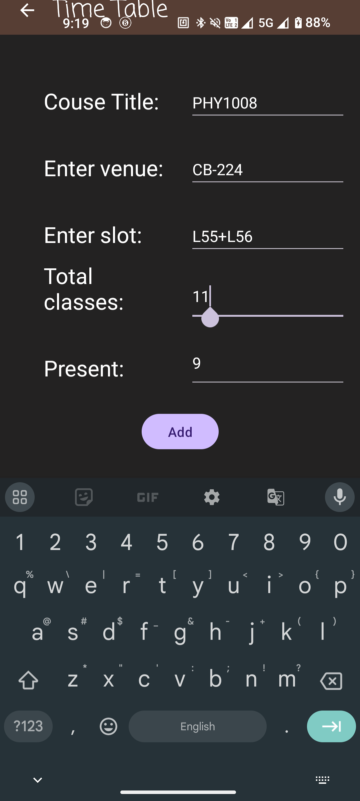

# Kitsune

Kitsune is an Android app built using Java to help you stay on top of your college classes by providing timely reminders for upcoming lectures.

## Features

- Add and manage your class schedule easily.
- Get notifications for upcoming classes.
- Simple and intuitive user interface.

## Screenshots

  
  
  
  

## Installation

You can download the latest APK from the [Releases](https://github.com/sathwikv2005/KitsuneAndroidApp/releases) page.
